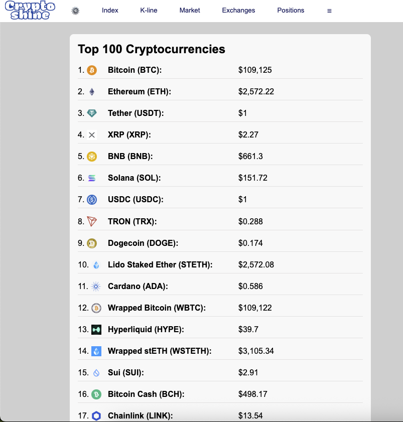

📈 Crypto Index App

**Description**: A responsive, multi-feature crypto dashboard built with React, Binance & CoinGecko APIs, featuring multilingual support and dark mode.  
**Website**: [https://crypto-index-app.web.app/index.html](https://crypto-index-app.web.app/index.html)  
**Topics**: React · Binance API · CoinGecko · Crypto Dashboard · Dark Mode · i18n · Charting · Frontend Portfolio  

# 📈 Crypto Index App
A responsive, multi-feature crypto dashboard built with React, showcasing real-time market data using Binance and CoinGecko APIs. Designed for fast performance, clean UI/UX, and international audiences (EN/中文 supported).

---

## 🚀 Live Demo

👉 [Open App on Firebase][https://crypto-index-app.web.app/index.html](https://crypto-index-app.web.app/index.html)  


---

## 🛠️ Features

### ✅ Core

- 🔝 **Top Tokens View** — List of top tokens by market cap  
- 🔍 **Trending Coins** — Live trending search from CoinGecko  
- 🆕 **New Listings** — Recently updated assets  
- 📈 **K-Line Chart** — Hourly candlestick charts for BTC/ETH  
- 💰 **Spot & Futures Market** — Real-time trading data from Binance  
- 🌐 **Multilingual UI** — Language toggle (English / 中文)  
- 🌙 **Dark Mode** — Theme toggle for accessibility  

### 🏆 Advanced

- ⚖️ **Long/Short Ratios** — Sentiment data from Binance Futures  
- 👨‍💻 **Top Traders** — Aggregated long/short positions of Binance top users  
- 💸 **Funding Rates** — Real-time rates for top USDT pairs  
- 🏦 **Centralized Exchanges** — Trust-ranked exchanges with volume stats  
- 🧩 **Mock Fallback System** — Works offline or on API failure using mock data  
- 🧠 **Responsive Menu** — Dynamic menu with breakpoint-aware overflow handling  

---

## 🧩 Tech Stack

- **Frontend**: React 18, Vite, JSX, CSS Modules  
- **Charting**: ApexCharts (candlestick)  
- **Icons**: React Icons  
- **i18n**: `react-i18next` + `i18next-browser-languagedetector`  
- **APIs**: Binance Futures API, CoinGecko API  
- **Deployment**: Firebase Hosting  
- **Fallback Strategy**: Custom `fetchWithFallback` utility

---

## 📁 Folder Structure

```
src/
├── App.jsx
├── components
│   ├── AllFundingRates.jsx
│   ├── CentralizedExchanges.jsx
│   ├── FuturesMarket.jsx
│   ├── KLine
│   │   └── KLineChart.jsx
│   ├── LongShortRatio.jsx
│   ├── NewListings.jsx
│   ├── SpotMarket.jsx
│   ├── TokenList.css
│   ├── TokenList.jsx
│   ├── Topbar
│   │   ├── LanguagePopup.css
│   │   ├── LanguagePopup.jsx
│   │   ├── SharedMenus.js
│   │   ├── Topbar.css
│   │   ├── TopBar.jsx
│   │   └── useDarkMode.js
│   ├── TopTraders.jsx
│   └── TrendingCoins.jsx
├── i18n.js
├── locales
│   ├── en.json
│   └── zh.json
├── main.jsx
├── mock
│   ├── coins.json
│   ├── exchanges.json
│   ├── fundingRates.json
│   ├── futures.json
│   ├── longShortRatios.json
│   ├── newListings.json
│   ├── topTraders.json
│   └── trending.json
├── styles
│   ├── dark-mode.css
│   ├── globals.css
│   └── reset.css
└── utils
    └── fetchWithFallback.js
```


---

## 🧪 Development Setup

1. **Clone repo**
   ```bash
   git clone https://github.com/your-username/crypto-index-app.git
   cd crypto-index-app

   npm install
   npm run dev
   npm run build


  


